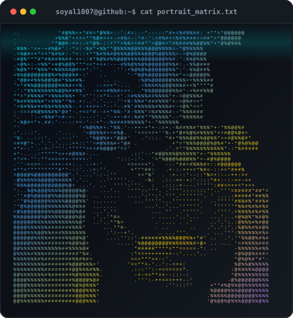
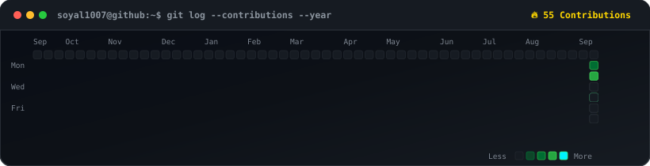

  <h1>⚡ <code>soyal@github ~ $ whoami</code> ⚡</h1>
  
<strong>Soyal</strong> • Full-Stack &amp; Systems Engineer • India

  
<em>Building intelligent applications, personal safety platforms &amp; modern developer tools.</em>

  

    
    &nbsp;
    
  

 

<!-- Hero Section: Perfectly Aligned Side-by-Side Cards (No Table Border Artifacts) -->

  
  &nbsp;&nbsp;
  

 

<!-- Contribution Heatmap -->

  <h2><code>git log --contributions --year</code></h2>
  

 

## 🛠️ Tech Stack &amp; Ecosystem

  
  
  
  
  
  

  
  
  
  
  

  
  
  
  
  

 

## 🚀 Featured Projects

| Project | Description | Tech Stack | Repository |
| :--- | :--- | :--- | :--- |
| 🛡️ **[RAKSHAK / SafeHer](https://github.com/Soyal1007/SafeHer-)** | Intelligent emergency protection system with voice-triggered SOS activation, live audio/video evidence capture & trusted contact dispatch. | `Flutter` • `Android` • `Firebase` | [Soyal1007/SafeHer-](https://github.com/Soyal1007/SafeHer-) |
| 🖨️ **[smart-print](https://github.com/Soyal1007/smart-print)** | Automated smart printing & document transformation utility for CLI and automated workflows. | `Python` • `CLI` • `Automation` | [Soyal1007/smart-print](https://github.com/Soyal1007/smart-print) |
| ⚡ **[Personal Command Center](https://github.com/Soyal1007)** | Feature-rich extension personal dashboard featuring rapid note capture, page saving, timeline search & local persistence. | `JavaScript` • `WebExtensions` | [Soyal1007](https://github.com/Soyal1007) |

 

## 📈 GitHub Analytics

  
  

 

  <em>Crafted with precision. Driven by curiosity, clean code, and continuous creation.</em>

